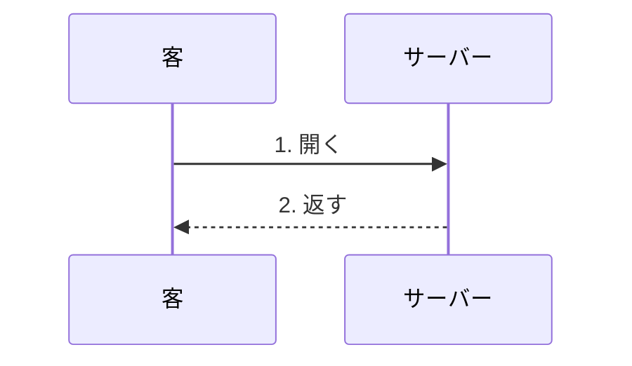

# タイトル

リード。



## 2. 円価格を返す

`fx/converter.py` · `to_jpy()`

```python
to_jpy(Decimal("29.99"), "USD")
```

## 4c. 取り扱いのない通貨 ⚠️

`fx/rate_client.py` · `RateUnavailable`

```python
RateUnavailable("BRL")
```
